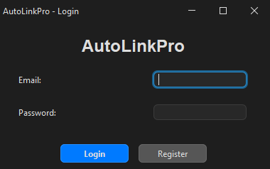
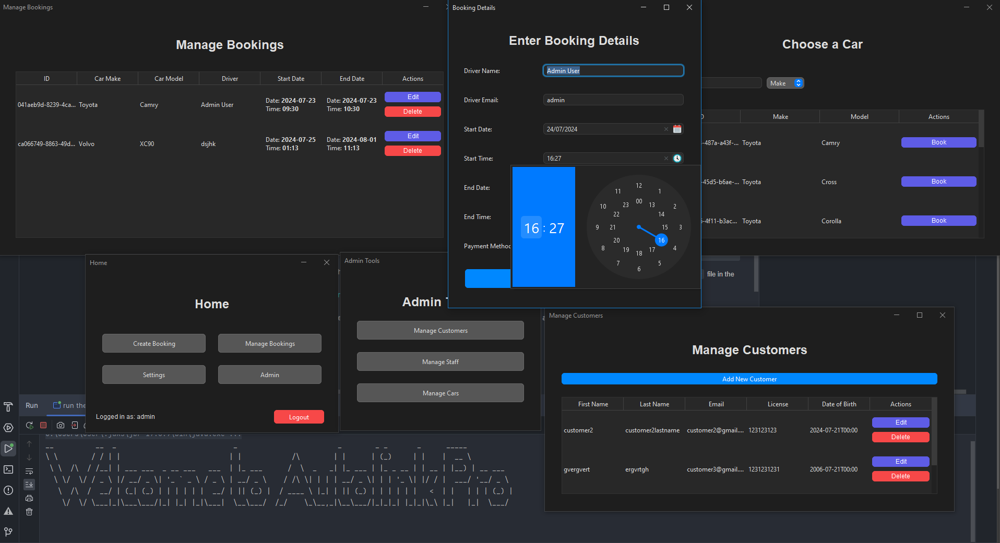

# AutoLink Pro

A _slightly_ cancerous, FlatLaf-based Swing application for car rental management written in Java. Stores data using the `JSON` format through an adapted version of Google's `gson` library.



## Building

This project uses both `Maven` and local libraries (stored in `src/main/resources/lib/`). Ensure you have `Maven` installed, either externally or through an IDE such as `IntelliJ IDEA`. 

> [!IMPORTANT]  
> You will have to install (link) the external `.jar` into your local repository by running the command below in a `Maven` environment.

If you are using `IntelliJ`, double tap the `ctrl` key and run the following command.

```bash
mvn install:install-file
        -Dfile=src/main/resources/lib/swing-datetime-picker.jar
        -DgroupId=raven.datetime
        -DartifactId=swing-datetime-picker
        -Dversion=1.3.0
        -Dpackaging=jar
```

Open project, reload `Maven`, Generate Sources & Update Folders, then execute:

```bash
mvn clean compile assembly:single
```

This will create a executable `.jar` file in the `target/` directory.

## Usage

`AutoLinkPro` will automatically detect a first boot if no existing data is found. In the case no data is found, it will automatically create a `data/` folder in the directory where it was run.

The default login (with superuser permissions) is `admin@autolinkpro.com` with password `changeme`.

## Restoring Corrupt Instances

`AutoLinkPro` will attempt to recover any usable data if it can detect an existing `data` directory. However, note that you will not be able to log in unless an `owner.json` file is defined in the `data/users/` directory.

## Screenshots


